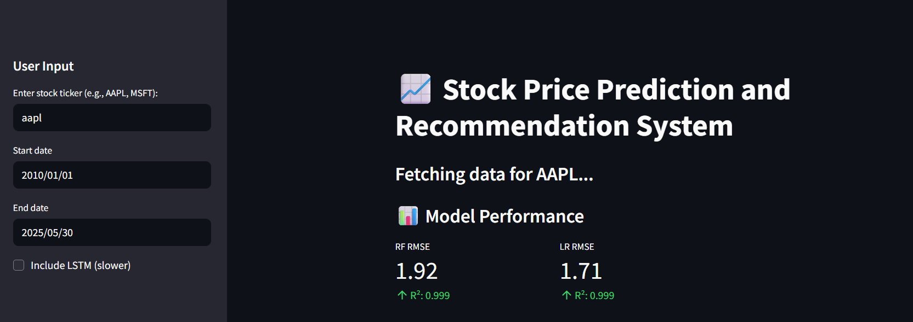
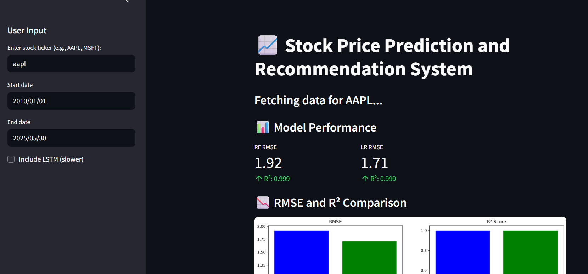
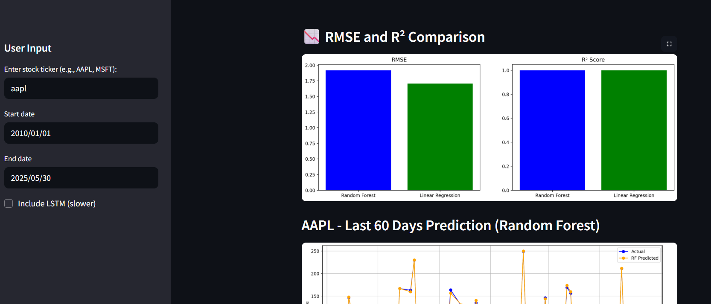
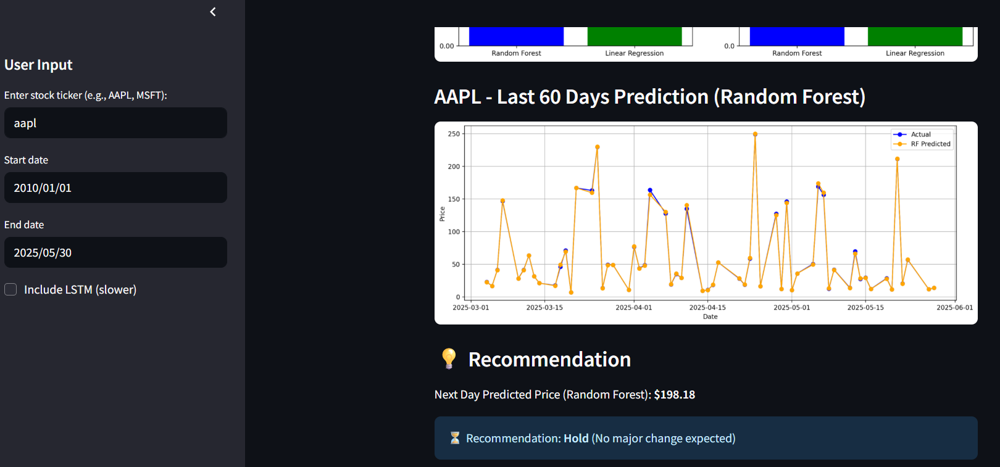

# 📈 Stock Price Prediction and Recommendation System

A Streamlit-based ML app that predicts future stock prices using Random Forest, Linear Regression, and optionally LSTM. The app also gives **Buy/Sell/Hold** recommendations based on expected price changes.

## 🚀 Features
- Real-time stock data using Yahoo Finance
- Models: Random Forest, Linear Regression, LSTM (optional)
- RMSE & R² score comparisons
- Buy/Sell/Hold recommendation logic
- Interactive Streamlit UI with visualizations

## 🧠 Tech Stack
- Python
- Streamlit
- yfinance, pandas, numpy
- scikit-learn, TensorFlow
- matplotlib

## 📦 Installation

Clone the repo and install dependencies:

```bash
pip install -r requirements.txt
streamlit run app.py
```

## 📊 Screenshots






## 📅 Project Summary

This project was built as part of an academic learning initiative and demonstrates a practical ML use case in the financial domain. It aims to make market predictions interpretable and actionable with simple model comparisons.

## 👩‍💻 Author

**Bommaraju Haritha**  
Aspiring Software Engineer | B.Tech CSE (2026)  
Sreyas Institute of Engineering and Technology  
